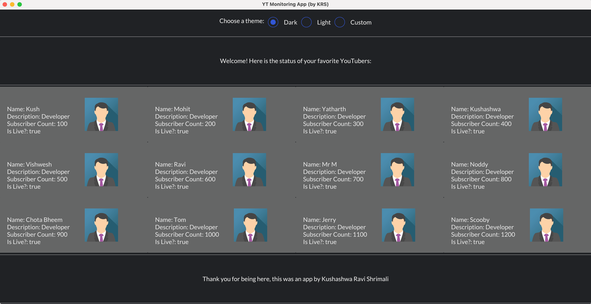

## YouTube Monitoring App (using Rust)

**Heavy WIP**. Another version of this project is present here: https://github.com/krshrimali/youtuber-monitoring-app.

I'm just trying to figure out if I can build something for the YT monitoring app using [iced-rs library](https://github.com/iced-rs/iced).

If you're curious what this is about, check out the [YT monitoring App stream series](https://www.youtube.com/playlist?list=PLfjzHJeA53gS-RyxHcpNdf85Q4tR_ZJ6_) on my [YouTube channel](https://youtube.com/c/kushashwaraviShrimali).

## Instructions

Assuming you have `cargo` installed and rust setup, following Instructions should work:

```bash
cargo build
cargo run
```

## Demo


